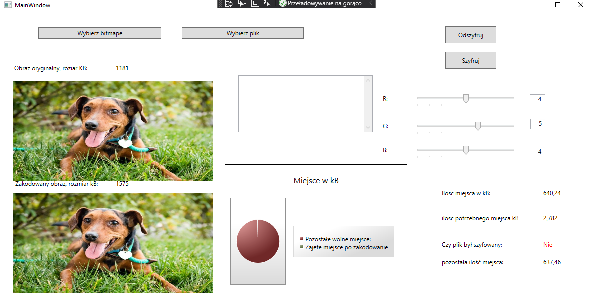

# Steganography
Simple steganography desktop app created witch c# and WPF. App was created as school project. This project allows users to encrypt plain text in to images.

## Table of contents
* [General info](#general-info)
* [Screenshots](#screenshots)
* [Technologies](#technologies)
* [Setup](#setup)
* [Features](#features)
* [Status](#status)

## General info
Thanks to this app user can encrypt text in image. There is possibility to modify amount of bits on which text will be saved. Encrypted image can be decrypted in the app. 

## Screenshots

## Technologies
* C# 
* .Net Framevork - version 4.72
* WPF 

## Setup
To run app user should open "Steganografia.exe" file in Windows 10/7.

## Features
List of features ready and TODOs for future development
* User can choose on which bytes from rgb in image, text will be written.
* Pie chart shows how much free space left in image to encode text.
* App allows to encrypt text in image as well as decrypt tex from image.

## Status
Project is:  _no longer continue_ 

